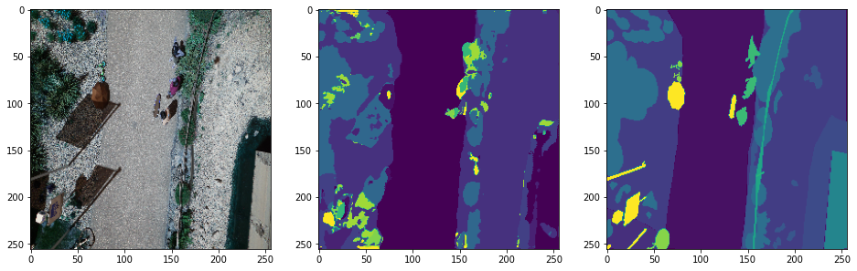

# AerialSemanticSegmentation

Image segmentation on the [Aerial Semantic Segmentation Drone Dataset](https://www.kaggle.com/bulentsiyah/semantic-drone-dataset) with a VGG16 encoder Unet in Keras.

Here are some results on validation set, the middle is the prediction, the right is the ground true. More information in the notebook.

